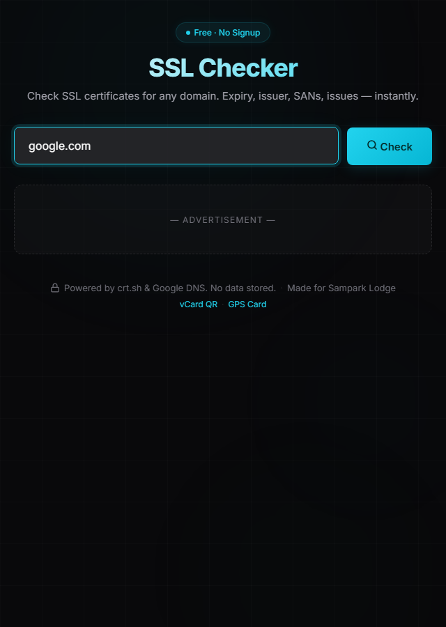

<p align="center">
  <picture>
    <source media="(prefers-color-scheme: dark)" srcset="preview.png">
    
  </picture>
</p>

<h1 align="center">SSL Certificate Checker</h1>

<p align="center">
  <b>Free online SSL/TLS certificate validator.</b><br>
  <i>Check expiry, issuer, SANs, and coverage for any domain.</i>
</p>

<p align="center">
  <a href="https://sampark-lodge.github.io/ssl-cert-checker/">
    
  </a>
  <a href="https://github.com/Sampark-Lodge/ssl-cert-checker">
    
  </a>
  <a href="LICENSE">
    
  </a>
  <br>
  
  
  
  
</p>

<br>

---

## ✦ Overview

**SSL Certificate Checker** analyzes SSL/TLS certificates for any domain using **Certificate Transparency logs** via `crt.sh` and DNS resolution via **Google DNS over HTTPS**. No server, no install — everything runs in your browser.

Check certificate expiry, identify the issuer, list all Subject Alternative Names (SANs), detect coverage gaps, and flag potential issues — all for free.

<br>

## ✦ Features

| | |
|---|---|
| ✦ **📅 Expiry tracking** | See exactly when a certificate expires with color-coded badge |
| ✦ **🏢 Issuer identification** | Shows who issued the certificate |
| ✦ **📋 SANs listing** | Lists all Subject Alternative Names with wildcard detection |
| ✦ **🔗 Coverage check** | Verifies www. and apex domain coverage |
| ✦ **🚨 Issue detection** | Flags expired certs, self-signed certs, DNS issues, missing coverage |
| ✦ **📡 DNS resolution** | Checks if the domain resolves via Google DNS over HTTPS |
| ✦ **🌙 Living design** | Animated cyan orbs, glow effects, smooth micro-interactions |
| ✦ **📱 Fully responsive** | Works on phone, tablet, and desktop |

<br>

## ✦ How It Works

```
   Enter Domain  →  Fetch crt.sh CT logs  →  Google DNS lookup
         │                 │                         │
         └─────────────────┴─────────────────────────┘
                           │
                 Certificate data analyzed
                           │
        ┌──────────────────┼──────────────────┐
        ▼                  ▼                  ▼
   Expiry check      SANs parsed        Issues flagged
   Issuer info       Coverage check     DNS status
```

<p align="center">
  <em>Powered by <a href="https://crt.sh/">crt.sh</a> Certificate Transparency logs and <a href="https://developers.google.com/speed/public-dns">Google DNS over HTTPS</a>.</em>
</p>

<br>

## ✦ Visual Design

```
┌──────────────────────────────────────────────────┐
│                 SSL Certificate Checker            │
│             Free · No Signup                       │
│  ┌──────────────────────────────────────────────┐ │
│  │  [ domain input          ] [ 🔍 Check ]     │ │
│  ├──────────────────────────────────────────────┤ │
│  │  example.com                    ✅ 120 days  │ │
│  │  ──────────────────────────────────────────── │ │
│  │  📡 DNS resolved — domain is reachable        │ │
│  │                                               │ │
│  │  Valid From    │  Valid Until  │  Issuer      │ │
│  │  2026-01-15    │  2026-09-15   │  GTS CA 1C3  │ │
│  │                                               │ │
│  │  SANs ──── 3                                   │ │
│  │  example.com  *.example.com  *.cdn.example...  │ │
│  │                                               │ │
│  │  ✅ www. covered    ✅ Apex domain covered    │ │
│  │                                               │ │
│  │  ⚠️ Issues Found                              │ │
│  │  ⚠ Certificate expires in 45 days.            │ │
│  └──────────────────────────────────────────────┘ │
│        🔒 Powered by crt.sh. No data stored.       │
└──────────────────────────────────────────────────┘
```

### Design Tokens

| Token | Value | Preview |
|---|---|---|
| `--bg` | `#09090b` |  Near-black |
| `--surface` | `#18181b` |  Card surface |
| `--accent` | `#22d3ee` |  Cyan |
| `--success` | `#10b981` |  Green |
| `--warning` | `#f59e0b` |  Amber |
| `--danger` | `#ef4444` |  Red |

<br>

## ✦ Tech Stack

```
┌────────────────────────────────────────────────┐
│               index.html (7 KB gz)               │
│  ┌──────────┐  ┌──────────┐  ┌────────────────┐ │
│  │  HTML5   │  │  CSS3    │  │   Vanilla JS   │ │
│  │  Semanti │  │  Flexbox │  │   crt.sh API   │ │
│  │  c       │  │  Custom  │  │   Google DNS   │ │
│  │  Layout  │  │  Props   │  │   Animations   │ │
│  │          │  │  + Animat│  │                │ │
│  │          │  │  ions    │  │                │ │
│  └──────────┘  └──────────┘  └────────────────┘ │
│                                                   │
│  External: crt.sh CT Logs  ·  Google DNS HTTPS   │
│  Google Fonts (Inter)      ·  AdSense             │
│  Hosting: GitHub Pages                            │
└───────────────────────────────────────────────────┘
```

- **Zero build tools** — no npm, no webpack, no config
- **Zero servers** — API calls are browser-to-service directly
- **Zero tracking** — no cookies, no analytics, no telemetry
- **Zero dependencies** — no libraries loaded

<br>

## ✦ Data Sources

| Source | Purpose |
|---|---|
| [`crt.sh`](https://crt.sh/) | Certificate Transparency log search — fetches certificate data |
| [`dns.google`](https://developers.google.com/speed/public-dns) | DNS over HTTPS — checks domain resolution |

<br>

## ✦ Detection Capabilities

| Check | Severity |
|---|---|
| ❌ Certificate expired | 🔴 Error |
| ❌ Expiring within 15 days | 🔴 Error |
| ⚠ Expiring within 30 days | 🟡 Warning |
| ⚠ Self-signed certificate | 🟡 Warning |
| ❌ DNS not resolving | 🔴 Error |
| ⚠ www. subdomain not covered | 🟡 Warning |
| ⚠ Apex domain not covered | 🟡 Warning |

<br>

## ✦ File Structure

```
ssl-cert-checker/
├── index.html              ← Entire application
├── preview.png             ← Social preview
├── robots.txt              ← SEO crawl rules
├── sitemap.xml             ← SEO sitemap
├── google36a7bd06114b150d.html ← Google verification
└── README.md               ← You are here
```

<br>

## ✦ Local Usage

```bash
git clone https://github.com/Sampark-Lodge/ssl-cert-checker.git
cd ssl-cert-checker
open index.html
```

Or use it at **[https://sampark-lodge.github.io/ssl-cert-checker/](https://sampark-lodge.github.io/ssl-cert-checker/)** — no installation required.

<br>

## ✦ Privacy

> **No data is stored or transmitted to my servers.**

Certificate data is fetched directly from `crt.sh` and `dns.google` in your browser. There is no intermediary backend, no logging, and no tracking.

<p align="center">
  
  
  
  
</p>

<br>

## ✦ Use Cases

- 🛡️ **Sysadmins** — monitor certificate expiry across domains
- 🌐 **Website owners** — verify your SSL is correctly configured
- 🔍 **Security researchers** — quickly inspect certificate details
- 📋 **DevOps engineers** — validate cert coverage before deployment
- 🧪 **Penetration testers** — gather certificate intelligence via CT logs

<br>

---

<p align="center">
  <sub>Built with ❤️ for Sampark Lodge · Made in India 🇮🇳</sub>
  <br>
  <sub>
    <a href="https://sampark-lodge.github.io/ssl-cert-checker/">Launch App</a> ·
    <a href="https://github.com/Sampark-Lodge/ssl-cert-checker/issues">Report Issue</a>
  </sub>
</p>
